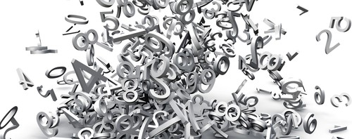

## Blog Post 5

According to the article, data tidying is the process of "structuring datasets to facilitate analysis"(Wickham). This relates to our class discussions, since we have been practicing techniques with SQL in order to quickly pull information from a dataset. The class as a whole is centered around learning how to handle data in a logical way that leads to fruitful data analysis and organization instead of getting lost in piles of numbers. Finding a way to place data in easily organized tables is a common tie between this article and the AGRON 590 course. We've talked about Codd's 3rd normal form in class and tidy data follows this form. In the article, tidy data is categorized as a table in which:
1. Each variable forms a column.
2. Each observation forms a row.
3. Each type of observational unit forms a table (Wickham)
Thus, our classwork on relational databases ties in nicely with the framework of tidy datasets. 
Another concept we have discussed in class which pops up here is the mention of not putting multiple values in a single column to make the data analysis part of the process less of a hassle. 

The benefits of keeping data tidy are that a tidy dataset can be used as an input and return an output that in turn can be used as an input for another analysis. Also, variables are stored in "a consistent, explicit manner" (Wickman). Tidy data are also more easily manipulated by tools that are attuned to working with tidy data. Due to a plethora or tools, even multidimensionla arrays will be able to be made more efficient with tidy data structures. Also, a benefit of tidy datasets is the simple set of tools needed "todeal with a wide range of un-tidy datasets" (Wickham). 

The drawbacks to tidy data are that tidy data is only useful if there are tidy data tools that improve workflow. Otherwise, organizing the data in this way would not be worthwhile if it didn't help with the analysis process.  

