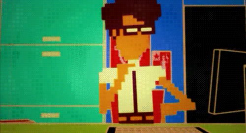

The paper "R: A Language for Data Analysis and Graphics" describes the development of R, a statistical computing language. It focuses on the issues they faced and lessons they learned while developing R. The authors describe how R is heavily influenced by the best aspects of two other languages: S and Scheme. It was a nice change of pace to learn about the history behind the development a language that I use almost every day instead of my seemingly mountainous task of learning how to use tons of individual R packages for specific applications in my research. It was interesting to learn about the basal components of a programming language, having never looked into it previously. I learned that syntax describes the instructions for computing and that the processes a computing language is capable of is semantics. Tools are collections of commonly utilized semantics that can be evoked by using syntax; the bridge between our written language and the computing language. Syntax, semantics and tools comprise the run-time enviroment - how we view the program. I think its great that R is open source because it allows for development of tools and packages that niche users like myself can use, making its applications very robust.

