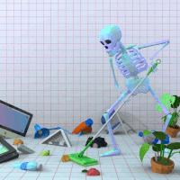

Moving towards seamless hypotheses generation...that's what I believe is the future of data analysis,
at least as far as life sciences are concerned. The ability to go from raw data to figures, 
with as little headache as possible, that tell you something about that data...that is what allows us to 
inform our questions. I believe that the tidyverse is helping us move towards this smooth flow from data
to communications, however, that is not the sole reason for it's existence. 

From Hadley's presentation, it's clear that to data analysis community (represented in part by Hadley) is 
attempting to move towards this goal as well. Hadley presents some good points that can help make this a 
seamless flow, by using a uniform interface and APIs he hopes to move towards a ***pit of success***. I 
like that analogy, to me it speaks of freeing an investigator from the drudgery of data management to 
unleash them onto discovering testable hypotheses. I know which I would rather work on!

Hadley's video covers his thoughts on what constitutes the "tidyverse" or a collection of R packages
that are designed to work together naturally, helping you move from data to communications. 
The tidyverse consists of the following packages:

* ggplot2
* tibble
* tidyr
* readr
* purrr
* dplyr
  
**The use of these tools is modeled by the following graphic from R for Data Science:**

I see data analysis moving towards a more streamlined system that uses structured (tidy) and a suite 
of tools to explore said data to find suitable questions (hypotheses) as painlessly as possible. One 
benefit of such a system is the distributed nature of tool production. Many investigators will have 
specific questions they need to ask and may develop a tool for that question. Now, if I come up with 
a similar question, I'm able to use their tool as long as my data is tidy. The movement toward open 
source data analysis and science in general is becoming more and more obvious! And what is the point
of all of this analysis? In the end it is to communicate our results to the public and our cohorts and
operating in the tidyverse will facilitate this. 
